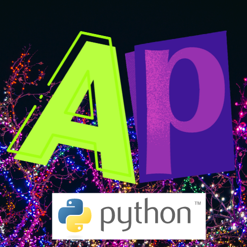

<!-- Title: -->
  
  <h1><a href="https://github.com/Spideyspidery/AnimPrint">AnimPrint</a> - Python</h1>
<!-- Labels: -->
  
  
  
<!-- Short description: -->
  <h3>My First Python Module | AnimPrint</h3>

This Module allows you to add a typing animation to your text in your Python Projects!

Thanks to [Mortis666](https://replit.com/@Mortis666)
